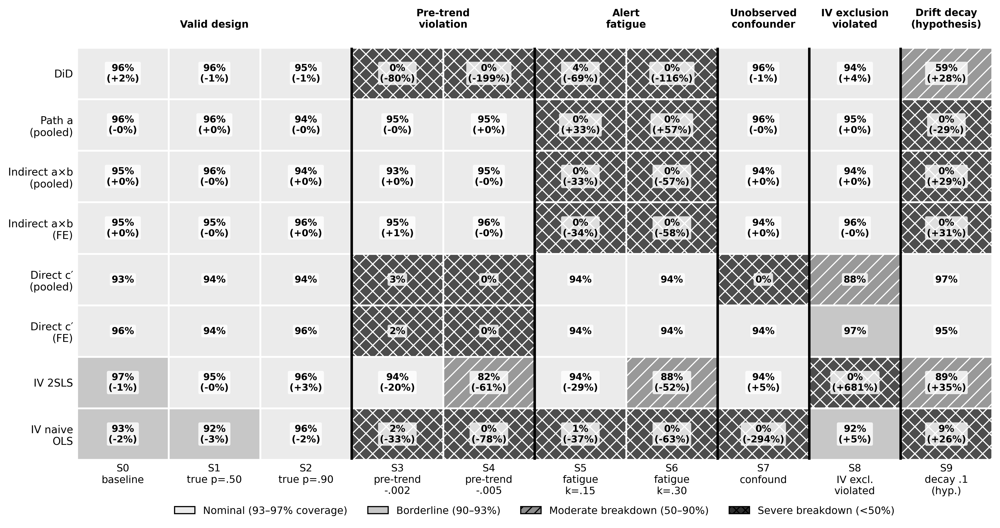
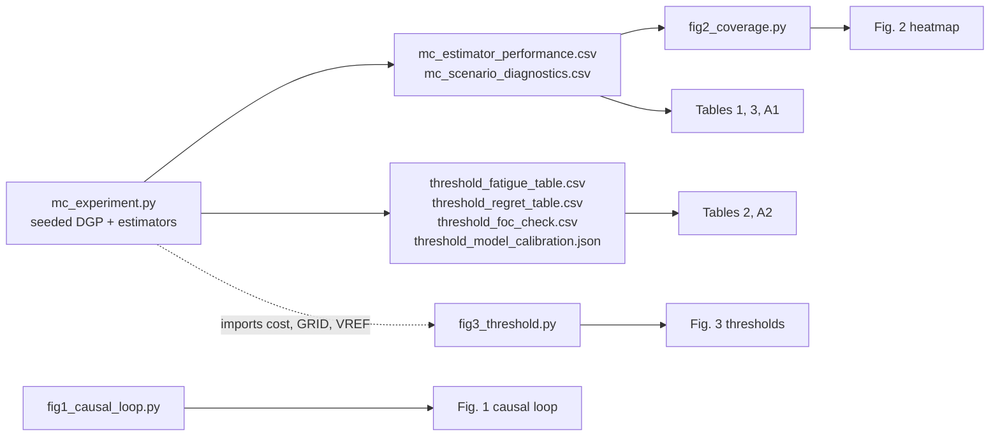
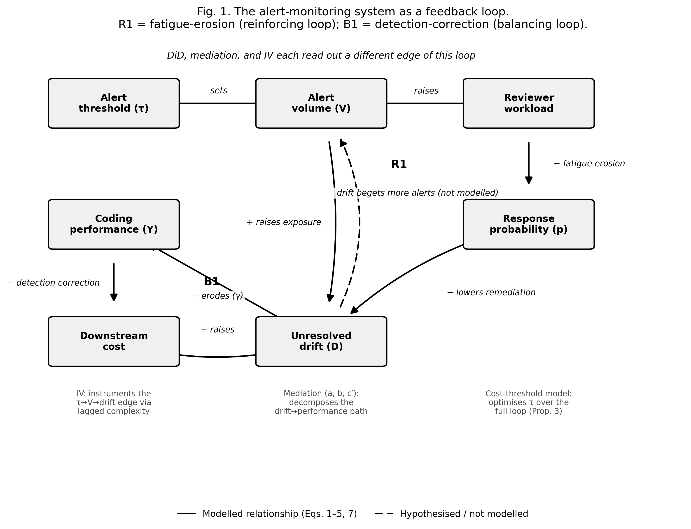
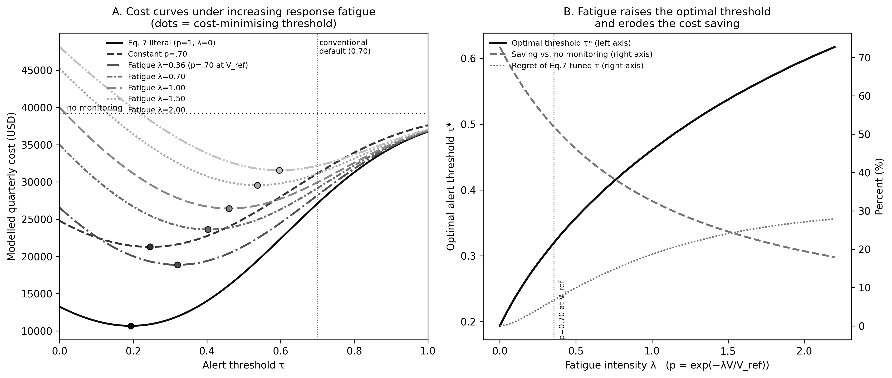

# Alert Fatigue: Causal Estimators & Thresholds

This repository contains everything needed to regenerate the numerical results (Tables 1–3, Appendix A1–A2) and the three figures of the manuscript: a seeded Monte Carlo study of three causal estimator families (DiD, mediation, IV) under reviewer response fatigue, and a cost-minimising alert-threshold model in which reviewer response falls with alert volume.



---

## Table of contents

1. [Repository tree](#1-repository-tree)
2. [Quick start](#2-quick-start)
3. [Research questions and what each artifact answers](#3-research-questions-and-what-each-artifact-answers)
4. [How the paper's methodology is implemented and analysed](#4-how-the-papers-methodology-is-implemented-and-analysed)
5. [Results and visualisations](#5-results-and-visualisations)
6. [File and column reference](#6-file-and-column-reference)
7. [Reproducibility check](#7-reproducibility-check)
8. [Known differences between manuscript and code (please read)](#8-known-differences-between-manuscript-and-code-please-read)
9. [Changes made to the original scripts](#9-changes-made-to-the-original-scripts)
10. [Citation and contact](#10-citation-and-contact)

---

## 1. Repository tree

```text
fatigue-alert-monitoring/
├── README.md                          # this file
├── requirements.txt                   # numpy, pandas, scipy, matplotlib
├── run_all.sh                         # one-command reproduction (~30 s)
├── .gitignore
│
├── src/                               # all code
│   ├── mc_experiment.py               # DGP, estimators, Monte Carlo, threshold model, FOC check
│   ├── fig1_causal_loop.py            # Fig. 1  - feedback-loop diagram
│   ├── fig2_coverage.py               # Fig. 2  - coverage heatmap (reads results/)
│   └── fig3_threshold.py              # Fig. 3  - cost curves & threshold-vs-fatigue (imports mc_experiment)
│
├── results/                           # machine-generated outputs of src/mc_experiment.py
│   ├── mc_estimator_performance.csv   # 90 rows: 10 scenarios x 9 estimator outputs  (Tables 1, 3, A1; Fig. 2)
│   ├── mc_scenario_diagnostics.csv    # alert rate, share treated, pooled effective p per scenario
│   ├── threshold_fatigue_table.csv    # tau*, saving, alerts/quarter per response model (Table 2; Fig. 3)
│   ├── threshold_regret_table.csv     # regret of mis-tuned thresholds (Table 2 "Regret" column)
│   ├── threshold_foc_check.csv        # numerical check of Proposition 3's first-order condition (Table A2)
│   └── threshold_model_calibration.json  # binormal parameters, AUC, V_ref, lambda_cal, lambda_crit
│
└── figures/                           # publication figures (300 dpi PNG)
    ├── fig1_causal_loop.png           # Fig. 1
    ├── fig2_coverage_heatmap.png      # Fig. 2
    └── fig3_threshold_fatigue.png     # Fig. 3
```

`results/mc_raw.csv` (about 3 MB, one row per replication x scenario x estimator) is written by the script but is git-ignored.

---

## 2. Quick start

```bash
git clone <this-repository>
cd fatigue-alert-monitoring
python -m venv .venv && source .venv/bin/activate      # optional
pip install -r requirements.txt
./run_all.sh                                            # regenerates results/ and figures/
```

Or step by step:

```bash
python src/mc_experiment.py      # Monte Carlo (R = 400, N = 2,500 per scenario) + threshold model
python src/fig1_causal_loop.py
python src/fig2_coverage.py      # requires results/mc_estimator_performance.csv
python src/fig3_threshold.py     # requires src/mc_experiment.py (imported)
```

* Runtime: about 25 s for the full experiment on a standard CPU (pure NumPy; no GPU).
* Smoke test: `MC_R=20 python src/mc_experiment.py` runs 20 instead of 400 replications.
* Python 3.9+ recommended. The script has no external data dependency: every dataset is simulated.



---

## 3. Research questions and what each artifact answers

| Manuscript RQ | Question | Primary artifact(s) | Where to look |
|---|---|---|---|
| **RQ1** Identification | What does DiD identify in an alert-exposure panel, and can the reviewer response probability be recovered? | `results/mc_estimator_performance.csv` (rows `DiD`, `DiD implied p-hat`) | [§5.2](#52-recovering-the-reviewer-response-probability-rq1) |
| **RQ2** Robustness | How do DiD, mediation and IV behave (bias, coverage) under pre-trends, fatigue, confounding and an invalid instrument? | `results/mc_estimator_performance.csv`, `figures/fig2_coverage_heatmap.png` | [§5.1](#51-coverage-of-analytical-targets-across-ten-scenarios-rq2) |
| **RQ3** Policy | How does volume-dependent response change the cost-minimising threshold and projected saving? | `results/threshold_*.csv`, `figures/fig3_threshold_fatigue.png` | [§5.3](#53-fatigue-adjusted-alert-thresholds-rq3) |
| Conceptual frame | How do the estimators and the threshold model relate to one causal structure? | `figures/fig1_causal_loop.png` | [§4.1](#41-conceptual-model-fig-1) |

---

## 4. How the paper's methodology is implemented and analysed

The analysis has two independent parts that share a common vocabulary (alert volume, reviewer response probability *p*, unresolved drift *D*): **Part A** is a panel Monte Carlo of causal estimators; **Part B** is a threshold-optimisation model. Both live in `src/mc_experiment.py`.

### 4.1 Conceptual model (Fig. 1)

`src/fig1_causal_loop.py` draws the system as two feedback loops: **R1** (alert volume → reviewer workload → response probability → unresolved drift → alert volume; fatigue erosion) and **B1** (unresolved drift → coding performance → downstream cost; detection–correction). Solid edges are modelled in Eqs. (1)–(5) and (7); the dashed drift → volume edge is hypothesised but not modelled. The figure also annotates which edge each method reads: IV the τ→V→drift edge, mediation the drift→performance path, and the threshold model the whole loop.



### 4.2 Part A — data-generating process (Manuscript §3.1; `gen_panel`)

| Manuscript element | Equation | Implementation in `gen_panel()` |
|---|---|---|
| Panel length T_i ∈ {4,5,6,7}, probs (0.4, 0.3, 0.2, 0.1) | — | `Tc = rng.choice([4,5,6,7], p=[.4,.3,.2,.1])`; 7 periods generated, then masked to `t <= Tc` |
| Persistent complexity m_i ~ N(1.2, 0.6²); log x_it = m_i + 0.3ε | — | `m`, `logx` |
| Latent alert propensity u_i ~ N(0,1) | — | `u` |
| Structural alert from lag-2 complexity (b₀ = −0.36, b₁ = 0.5) | Eq. (1) | `a = rng.random(N) < expit(b0 - b1*(lag-1.2) + u)` for t ≥ 2; period 1 has no alert |
| Cumulative alerts C_it | Eq. (2) | `cumC += a` |
| Bernoulli remediation with fatigue p₀·exp(−κ·max(C−1, 0)) | Eq. (3) | `pdec = p0*np.exp(-kappa*np.maximum(cumC-1, 0))`, `dec = rng.random(N) < pdec` |
| Cumulative unresolved drift D_it | Eq. (4) | `cumD += exp(-decay*(t+1)) * a * (~dec)` (`decay = 0` recovers the manuscript form) |
| Coding performance Y_it with γ = 0.02 | Eq. (5) | `Y = 0.85 - 0.01*(logx-1.2) + eta + phi_u*u + kappa_m*(m-1.2) - GAMMA*D + delta*(t-1)*treated + noise(0.02)` |
| Treated = cumulative alerts reach 2 by end of period 3 | — | `treated = (C[:,2] == 2)` |
| Lag-2 instrument z_it = log x_{i,t−2} − 1.2 | §3.2(iii) | `z[:, t] = logx[:, t-2] - 1.2` for t ≥ 3 (1-indexed) |

The scenario knobs that switch each departure on are the keyword arguments of `gen_panel`:

| Scenario | Departure | Code argument | Manuscript role |
|---|---|---|---|
| S0 | Valid design, p₀ = 0.70 | *(defaults)* | Baseline verification |
| S1 / S2 | Valid design, p₀ = 0.50 / 0.90 | `p0=0.5` / `p0=0.9` | Targets track a moving true p |
| S3 / S4 | Differential linear pre-trend (treated only) | `delta=-0.002` / `-0.005` | Violates parallel trends (A3) |
| S5 / S6 | Response fatigue | `kappa=0.15` / `0.30` | Departs from A1: **estimand shift** |
| S7 | Unobserved confounder | `phi_u=-0.03` | Omitted-variable bias |
| S8 | Invalid instrument (m_i enters Y directly) | `kappa_m=-0.02` | Violates IV exclusion |
| S9 | Exploratory drift decay (post hoc) | `decay=0.1` | Illustrative only |

### 4.3 Part A — estimators (Manuscript §3.2; `run_estimators`, `ols_cl`, `tsls_cl`, `within`)

All inference uses entity-clustered standard errors with the G/(G−1) small-sample factor (hand-rolled sandwich estimators in `ols_cl` and `tsls_cl`).

| Family | Manuscript spec | Implementation | Output rows in `mc_estimator_performance.csv` |
|---|---|---|---|
| **DiD** | Eq. (6): Y ~ Treated + Post + Treated×Post + (log x − 1.2), Post = 1{t ≥ 4}; β̂₃ is the estimate | `X = [1, tr, post, tr*post, lx]`, `b[3]` | `DiD`, and its inversion `DiD implied p-hat` = 1 + β̂₃/(γΔC) (Corollary 1a) |
| **Mediation (pooled)** | Path a: D ~ C + lx; path b and direct c′: Y ~ D + C + lx; indirect = â·b̂ with Sobel SE | Two clustered OLS fits | `Path a (pooled)`, `Indirect a*b (pooled)`, `Direct c' (pooled)` |
| **Mediation (entity FE)** | Same, after within-entity demeaning | `within()` then OLS | `Indirect a*b (FE)`, `Direct c' (FE)` |
| **IV (2SLS)** | Intensity I = C/t instrumented by lag-2 log-complexity, rows t ≥ 3, control for current complexity | `tsls_cl` | `IV 2SLS` |
| **IV naive OLS** | Same equation without instrumenting | `ols_cl` | `IV naive OLS` |

### 4.4 Part A — analytical targets (Manuscript §3.3, §4; Proposition 1, Table 1)

The Monte Carlo evaluates estimators against **analytical targets, not against zero**:

| Estimator | Target coded in `run_estimators` | Manuscript |
|---|---|---|
| DiD β̂₃ | `-GAMMA * (1 - p0) * dC`, with ΔC the four-cell double difference of cumulative alerts computed from each simulated sample | Proposition 1 |
| Path a | `1 - p0` | Table 1 |
| Indirect a×b | `-GAMMA * (1 - p0)` | Table 1 |
| Direct c′ | `0` (the DGP routes alerts → performance entirely through D) | Table 1 |
| IV 2SLS and naive OLS | mean over rows of `-GAMMA*(1 - p0)*t` (intensity is C/t, hence the scaling by t̄) | Table 1 |

Under fatigue (S5–S6), these constant-p targets are no longer the estimand. The CSV therefore reports coverage of the *constant-response benchmark*; the resulting near-zero coverage is an **estimand shift**, not estimator failure (Proposition 2(b); manuscript Table 3 evaluates against fatigue-adjusted targets).

### 4.5 Part A — Monte Carlo design and metrics (Manuscript §3.4–3.5; `monte_carlo`, `summarise`)

* R = 400 replications × N = 2,500 entities per scenario; scenario-specific seed `2026 + scenario index` (`np.random.default_rng`).
* Per scenario × estimator: mean estimate, mean target, **bias**, **relative bias** (bias/|target| × 100; undefined where target = 0), **RMSE**, Monte Carlo SD, mean estimated SE, **95% CI coverage of the analytical target** (`|est − target| ≤ 1.96·se`), and rejection rate of the null of no effect (`reject_zero`).
* Monte Carlo error of a coverage rate at 95% and R = 400 is about 1.1 percentage points, so coverage of roughly 93–97% is indistinguishable from nominal. `fig2_coverage.py` uses exactly these bands.

### 4.6 Part B — threshold-optimisation model (Manuscript §3.6, Proposition 3; `cost`, `threshold_table`, `foc_check`)

1. **Binormal score model calibrated to two ROC points.** (FPR, TPR) = (0.078, 0.954) and (0.011, 0.343) at thresholds 0.105 and 0.70 give negative-class N(−0.863, 0.683²) and positive-class N(0.585, 0.285²), AUC = 0.975 (`results/threshold_model_calibration.json`).
2. **Class sizes.** N_pos = 39,205 / C_FN = 7,841 and N_neg = 128,945 − N_pos = 121,104; cost ratio C_FN : C_FP = 5 : 1. The 39,205 figure is the quarterly no-monitoring cost.
3. **Volume and fatigue.** V(τ) = N_neg·FPR(τ) + N_pos·TPR(τ) (Eq. 7a); p(V) = exp(−λV/V_ref) with V_ref = V(0.105) = 16,926 (Eq. 7b).
4. **Cost** (Eq. 7): C_FP·N_neg·FPR + C_FN·[N_pos − p(V)·N_pos·TPR]. λ = 0 is the literal textbook rule (p ≡ 1); `'const'` switches fatigue off with p = 0.70 as an intermediate benchmark.
5. **Optimisation.** Exhaustive grid search over τ ∈ [0, 1] with width 0.0005, for seven response models: λ ∈ {0, const p = 0.70, λ_cal = 0.357, 0.70, 1.00, 1.50, 2.00}. λ_cal = −ln 0.70 is the value at which p(V_ref) = 0.70.
6. **Regret.** `threshold_regret_table.csv` reports the excess realised cost when τ is tuned on the literal Eq. 7 rule (or on constant p = 0.70) but the true response process is fatigue-calibrated.
7. **Proposition 3 check.** `foc_check()` evaluates, at each grid optimum, the empirical likelihood ratio f₁/f₀ and the closed-form right-hand side N_neg[C_FP + C_FN·N_pos·TPR·|p′|] / (C_FN·N_pos·[p − N_pos·TPR·|p′|]), with |p′| = λp/V_ref. `threshold_model_calibration.json` also stores λ_crit = V_ref / (N_pos·TPR(V_ref point)) = 2.263 (Corollary 3b, the local fatigue-collapse threshold).

---

## 5. Results and visualisations

### 5.1 Coverage of analytical targets across ten scenarios (RQ2)


Each cell shows 95% CI coverage of the analytical target with relative bias in parentheses (in the fatigue columns, the parenthesised value is the displacement from the constant-response benchmark). Shading: nominal 93–97%, borderline 90–93%, moderate breakdown 50–90% (hatched), severe breakdown < 50% (cross-hatched). S9 is exploratory.

Coverage (%) of the analytical target, taken directly from `results/mc_estimator_performance.csv`. **Bold** = below 50%.

| Estimator | S0 | S1 | S2 | S3 | S4 | S5 | S6 | S7 | S8 | S9 |
|---|---:|---:|---:|---:|---:|---:|---:|---:|---:|---:|
| DiD | 95.8 | 96.5 | 94.8 | **0.2** | **0.0** | **4.2** | **0.0** | 96.0 | 93.8 | 59.0 |
| Path a (pooled) | 95.5 | 95.8 | 93.5 | 94.8 | 94.8 | **0.0** | **0.0** | 95.5 | 94.8 | **0.0** |
| Indirect a×b (pooled) | 94.8 | 96.0 | 94.0 | 93.2 | 94.8 | **0.2** | **0.0** | 93.5 | 93.5 | **0.0** |
| Indirect a×b (FE) | 95.2 | 94.8 | 95.8 | 94.8 | 95.8 | **0.0** | **0.0** | 94.2 | 95.8 | **0.0** |
| Direct c' (pooled) | 93.2 | 94.5 | 94.2 | **3.2** | **0.0** | 94.0 | 94.5 | **0.0** | 87.8 | 96.8 |
| Direct c' (FE) | 95.5 | 93.8 | 96.0 | **1.8** | **0.0** | 93.5 | 93.8 | 94.5 | 97.2 | 95.0 |
| IV 2SLS | 97.2 | 94.8 | 95.8 | 94.2 | 82.2 | 94.0 | 87.5 | 94.5 | **0.0** | 89.0 |
| IV naive OLS | 92.8 | 91.5 | 96.0 | **2.2** | **0.0** | **1.0** | **0.0** | **0.0** | 91.5 | **9.0** |

What the grid shows:

* **Valid design (S0–S2):** every estimator sits in the nominal band (a few borderline cells for IV/OLS, within about two Monte Carlo standard errors), including when the true p moves to 0.50 or 0.90.
* **Pre-trends (S3–S4):** DiD, direct effects and naive OLS collapse (DiD coverage 0.2% at δ = −0.002; relative bias −80%, and −199% at δ = −0.005). Path a and the indirect effects are unaffected because the trend enters Y directly, not through D.
* **Fatigue (S5–S6):** DiD, path a and both indirect effects lose coverage of the *constant-response* target — an estimand shift. Path a moves **up** (0.30 → 0.399 → 0.471), DiD moves **down** (more negative).
* **Unobserved confounder (S7):** FE mediation remains valid, but pooled c′ is rejected as non-zero in 100% of replications and naive OLS shows −294% relative bias. This robustness of FE mediation is specific to a DGP in which D is generated by thinning C independently of u.
* **Invalid instrument (S8):** 2SLS moves from −0.025 to +0.145 (+681% relative bias, sign reversal, 0% coverage) while all other estimators are essentially unaffected.

### 5.2 Recovering the reviewer response probability (RQ1)

Corollary 1a inverts the DiD coefficient: p̂ = 1 + β̂₃ / (γΔC), with γ = 0.02.

| Scenario | Nominal p₀ | Mean DiD β̂₃ | Recovered p̂ (Cor. 1a) | 95% CI coverage of p₀ |
|---|---:|---:|---:|---:|
| S0 baseline (p=.70) | 0.70 | -0.00675 | 0.705 | 95.8% |
| S1 true p=.50 | 0.50 | -0.01154 | 0.494 | 96.5% |
| S2 true p=.90 | 0.90 | -0.00229 | 0.899 | 94.8% |
| S5 fatigue k=.15 | 0.70 | -0.01158 | 0.492 | 4.2% |
| S6 fatigue k=.30 | 0.70 | -0.01480 | 0.353 | 0.0% |

Under a valid design p̂ recovers the true p₀ (0.705, 0.494, 0.899 vs. 0.70, 0.50, 0.90). Under fatigue the recovered p̂ (0.49 and 0.35) is the **effective** response probability in the high-exposure exposure gap, far below the nominal 0.70. This is why the manuscript recommends reporting p̂ alongside β̂₃.

### 5.3 Fatigue-adjusted alert thresholds (RQ3)



**Panel A** plots modelled quarterly cost against threshold τ for the seven response models (dots = cost-minimising τ*; dotted horizontal line = $39,205 no-monitoring cost; dotted vertical line = conventional default 0.70). **Panel B** plots τ* (left axis), saving vs. no monitoring and regret of an Eq. 7-tuned threshold (right axis) against fatigue intensity λ; the vertical marker is λ_cal, where p = 0.70 at V_ref.

Numbers behind Table 2 (from `results/threshold_fatigue_table.csv` and `results/threshold_regret_table.csv`):

| Response model | λ | τ* | Alerts / quarter | p at τ* | Saving vs. no monitoring | Cost at τ=0.70 vs. no monitoring | Regret if tuned on Eq. 7 | Regret if tuned on const. p=0.70 |
|---|---:|---:|---:|---:|---:|---:|---:|---:|
| Eq.7 literal (p=1, lam=0) | 0.000 | 0.1935 | 14,537 | 1.000 | 72.8% | -30.9% | — | — |
| constant p=.70 | const | 0.2455 | 13,240 | 0.700 | 45.7% | -20.6% | — | — |
| fatigue lam=0.357 (p=.70 at V_ref) | 0.357 | 0.3200 | 11,484 | 0.785 | 51.9% | -28.1% | 6.8% | 2.4% |
| fatigue lam=0.70 | 0.700 | 0.4030 | 9,639 | 0.671 | 39.8% | -25.6% | 13.9% | 7.9% |
| fatigue lam=1.00 | 1.000 | 0.4605 | 8,420 | 0.608 | 32.6% | -23.6% | 18.6% | 12.3% |
| fatigue lam=1.50 | 1.500 | 0.5370 | 6,879 | 0.544 | 24.6% | -20.6% | 24.0% | 17.7% |
| fatigue lam=2.00 | 2.000 | 0.5965 | 5,758 | 0.506 | 19.5% | -17.9% | 27.1% | 21.2% |

Key takeaways:

* Moving from the literal rule (p = 1) to fatigue-calibrated models raises τ* from **0.19 to 0.32–0.60** and lowers the projected saving from **72.8% to 19.5–51.9%**.
* A constant, sub-unity response probability alone (p = 0.70) already moves τ* to 0.246 and the saving to 45.7%.
* Ignoring fatigue costs 6.8% (λ_cal) to 27.1% (λ = 2.00) in excess realised cost.
* The conventional default τ = 0.70 is above every cost-minimising threshold reported here.
* Proposition 3 check (`threshold_foc_check.csv`): empirical likelihood ratio vs. closed-form right-hand side agree within about 0.13% at the five λ values evaluated by the script.

---

## 6. File and column reference

### `results/mc_estimator_performance.csv` (90 rows)

| Column | Meaning |
|---|---|
| `scenario` | S0–S9 label |
| `estimator` | `DiD`, `DiD implied p-hat`, `Path a (pooled)`, `Indirect a*b (pooled)`, `Direct c' (pooled)`, `Indirect a*b (FE)`, `Direct c' (FE)`, `IV 2SLS`, `IV naive OLS` |
| `mean_est`, `target` | Mean estimate and mean analytical target over R = 400 replications |
| `bias`, `rel_bias_pct` | mean(est − target); 100·bias/\|target\| (NaN when target = 0) |
| `rmse`, `mc_sd` | Root mean squared error; Monte Carlo SD of the estimator |
| `mean_se` | Mean clustered standard error |
| `coverage` | Share of replications whose 95% CI contains the target (0–1) |
| `reject_zero` | Share of replications rejecting the null of no effect |

Note: the `DiD implied p-hat` row is a transformation of the DiD row, so its coverage equals DiD coverage by construction; it is not a ninth independent estimator in Fig. 2 or Table 1.

### `results/mc_scenario_diagnostics.csv`
Structural alert rate (calibration target 40–45%), share of entities classed as treated, and the pooled effective response probability (`effective_p` = remediated alerts / all alerts, over the last replication). This pooled quantity differs from the manuscript's exposure-gap p_eff = 1 − ΔD/ΔC (0.50 and 0.36 under S5 and S6).

### `results/threshold_fatigue_table.csv`
`model`, `lam`, `tau_opt`, `cost_opt`, `saving_pct`, `alerts_per_quarter`, `resp_prob_at_opt`, `cost_at_0p70`, `change_at_0p70_pct` (cost at the conventional τ = 0.70 relative to no monitoring).

### `results/threshold_regret_table.csv`
`true_model`, `tau_true`, `tau_if_tuned_on_Eq7`, `regret_Eq7_tuner_pct`, `tau_if_tuned_on_const_p`, `regret_constp_tuner_pct`.

### `results/threshold_foc_check.csv`
`lam`, `tau_opt`, `LR_at_opt` (empirical f₁/f₀), `LR_formula` (right-hand side of the first-order condition).

### `results/threshold_model_calibration.json`
`AUC_binormal`, `mu0`, `s0`, `mu1`, `s1`, `Npos`, `Nneg`, `Vref`, `lam_crit_at_ref`, `lam_cal`, and Eq. 7 cost at τ = 0.70 and τ = 0.105.

---

## 7. Reproducibility check

Before packaging, the pipeline was executed from this repository layout (after the path changes in §9):

* `python src/mc_experiment.py` completed in about 24 s.
* The regenerated `results/mc_estimator_performance.csv` and `results/threshold_fatigue_table.csv` are **byte-identical** to the originally supplied files (verified with `cmp`), so the seeds fully determine the reported Monte Carlo output on the tested environment.
* All three figure scripts ran successfully. The supplied Fig. 1 and Fig. 3 PNGs regenerate identically in size; the regenerated Fig. 2 differs in file size by about 1% (matplotlib rendering differences). The originally supplied PNGs are the ones committed in `figures/`.
* Exact NumPy/SciPy/matplotlib versions were not pinned. Small floating-point differences across library versions are possible, so pin versions (e.g. with `pip freeze`) when archiving the submission version.

---

## 8. Changes made to the original scripts

To make the repository self-contained and portable, only paths and one environment variable were changed; no model, estimator, seed or plotting logic was altered.

| File | Change |
|---|---|
| `src/mc_experiment.py` | Output directory changed from `/mnt/user-data/outputs` to `<repo>/results` (via `Path(__file__)`); raw replication file `/home/claude/mc_raw.csv` → `results/mc_raw.csv`; replication count now read from optional env var `MC_R` (default 400) |
| `src/fig1_causal_loop.py` | Output path → `<repo>/figures/` |
| `src/fig2_coverage.py` | Input CSV path → `<repo>/results/`; output path → `<repo>/figures/` |
| `src/fig3_threshold.py` | `sys.path` now points at `src/` instead of `/home/claude`; output path → `<repo>/figures/` |

---
